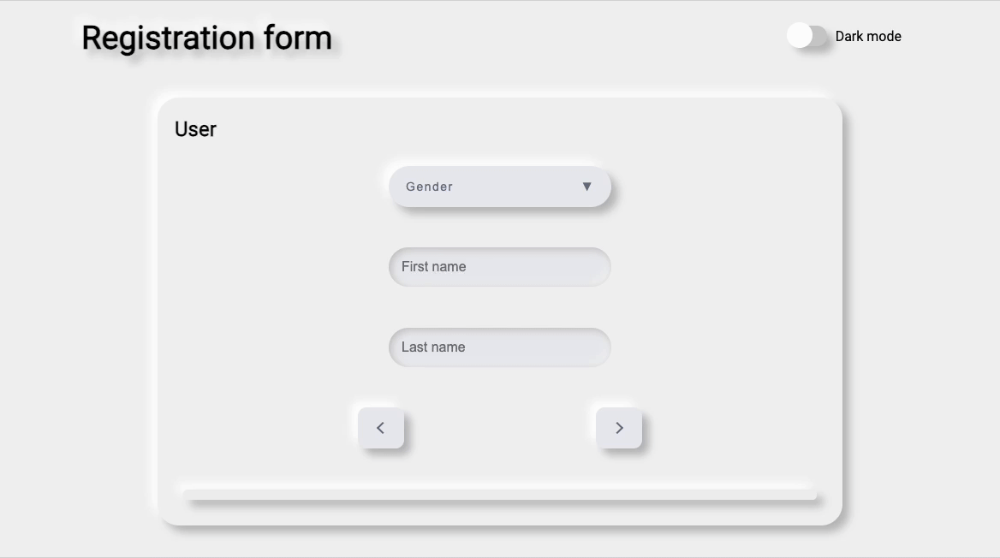
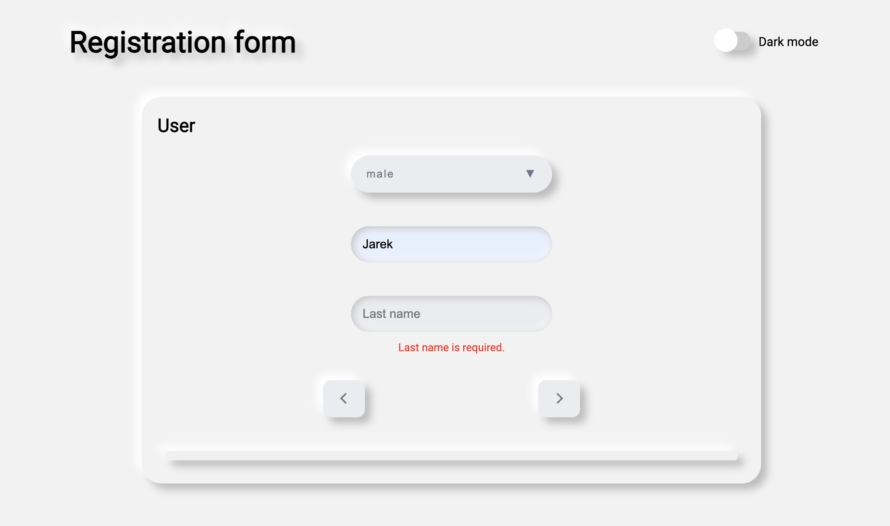
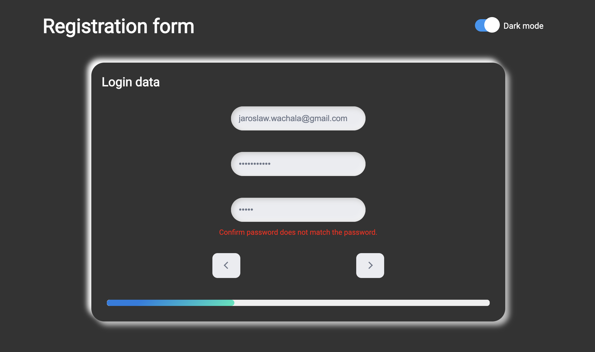

# Registration form

See the live version of [Registration form](https://jarekwach.github.io/Registration-form/build/).

Registration form is a multi-step form consisting of React components created according to the [neumorphism](https://www.justinmind.com/ui-design/neumorphism) trend and using Styled Components.

**Main features**:

- validation of all form fields
- progress bar showing the level of completion of the form
- dark and light theme - choice with custom switch component
- changing the pages of the form without losing the entered data
- neumorphism design

&nbsp;

## 💡 Technologies & tools


&nbsp;

## :camera: Screenshots

### Light theme



### Dark theme



&nbsp;

## :gear: Installation

The project uses [node](https://nodejs.org/en/) and [npm](https://www.npmjs.com/).
To run it locally you should install all dependencies:

```
npm i
```

To run webpack and create a localhost port you should type:

```
npm start
```

&nbsp;

## 🙋‍♂️ Feel free to contact me

Find me on...

[](https://www.linkedin.com/in/jarosław-wąchała/)
[](mailto:jaroslaw.wachala@gmail.com)

&nbsp;

## 👏 Special thanks / Credits

Thanks to my [Mentor - devmentor.pl](https://devmentor.pl/) – for providing me with this task and for code review.
